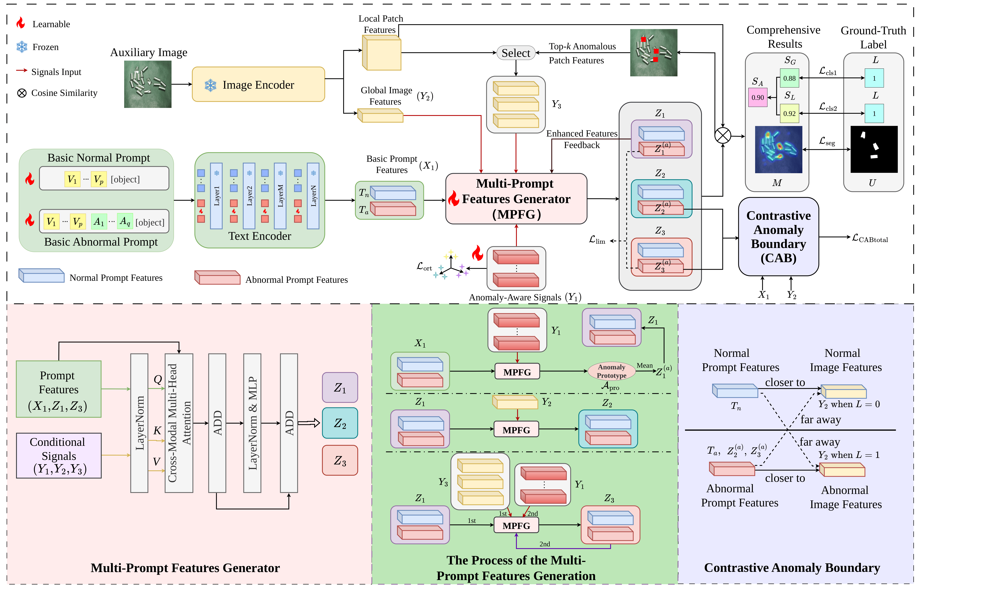

# EDMPrompt: Towards Efffcient Generation of Discriminative Multi-Prompt Features for Zero-Shot Anomaly Detection

<div align="center">

[](https://pytorch.org/)
[](https://developer.nvidia.com/cuda-toolkit)
[](https://www.python.org/)
[](LICENSE)

</div>

## 📖 Introduction

**EDMPrompt** is a CLIP-based visual anomaly detection framework that leverages prompt learning to distinguish between normal and anomalous samples without requiring full model fine-tuning. By learning a small set of learnable prompt tokens and employing a **Multi-Perspective Feature Generation (MPFG)** module and a  **Contrastive Anomaly Boundary(CAB)** module , the model adapts pre-trained vision-language knowledge to the anomaly detection domain efficiently.

### Key Features

- 🎯 **Prompt-driven Anomaly Detection** — Learns dual prompts (normal vs. abnormal) to enable zero-shot-style generalization across diverse industrial and medical datasets
- 🔬 **SignalPrompt** — Generates fine-grained, multi-perspective text features through learnable "signal" tokens and cross-attention via MPFG and refine them by CAB.
- 🧠 **BasePrompt** — Lightweight learnable prompt adaptation on top of frozen CLIP (ViT-L/14@336px) backbone
- 📊 **Comprehensive Evaluation** — Supports image-level, pixel-level, and joint metrics (AUROC, AP, AUPRO) across 14 datasets
- 🏭 **Industrial & Medical Coverage** — Out-of-the-box support for MVTec AD, VisA, BTAD, MPDD, SDD, DTD, and multiple medical imaging benchmarks


<p align="center">
  
</p>

## 📦 Supported Datasets

| Category | Datasets |
|----------|----------|
| **Industrial** | MVTec AD, VisA, BTAD, MPDD, SDD, DTD |
| **Medical — Colonoscopy** | Kvasir, CVC-ClinicDB, CVC-ColonDB, Endo |
| **Medical — Radiology** | BrainMRI, HeadCT, BR35 |
| **Medical — Other** | ISBI (skin)|

## 🚀 Quick Start

### Prerequisites

- Python 3.11+
- CUDA 11.8+ 
- PyTorch 2.6.0

### Installation

```bash
# Clone the repository
git clone https://github.com/lake-user/EDMPrompt.git
cd EDMPrompt

# Install dependencies
pip install -r requirements.txt
```

## 💻 Usage

### Training

```bash
python train.py \
    --train_data_path ./dataset/mvtec \
    --dataset mvtec \
    --save_path ./checkpoint \
    --epoch 10 \
    --batch_size 8 \
    --learning_rate 0.001 \
    --image_size 518 \
    --depth 9 \
    --n_ctx 12 \
    --t_n_ctx 4 \
    --seed 111
```

| Argument | Default | Description |
|----------|---------|-------------|
| `--train_data_path` | `./dataset/mvtec` | Path to training dataset |
| `--dataset` | `mvtec` | Dataset name (see supported datasets) |
| `--save_path` | `./checkpoint` | Directory to save model checkpoints |
| `--epoch` | `10` | Number of training epochs |
| `--batch_size` | `8` | Training batch size |
| `--learning_rate` | `0.001` | Learning rate for Adam optimizer |
| `--image_size` | `518` | Input image resolution |
| `--depth` | `9` | Learnable text embedding depth |
| `--n_ctx` | `12` | Number of learnable prompt context tokens |
| `--t_n_ctx` | `4` | Length of compound text embeddings |
| `--print_freq` | `1` | Logging frequency (epochs) |
| `--save_freq` | `1` | Checkpoint save frequency (epochs) |
| `--seed` | `111` | Random seed for reproducibility |

### Testing (Single Dataset)

```bash
# Image + Pixel combined evaluation
python test.py \
    --data_path ./dataset/mvtec \
    --dataset mvtec \
    --checkpoint_path ./checkpoint/epoch_7.pth \
    --save_path ./results/mvtec \
    --metrics image-pixel-level \
    --image_size 518
```

| Argument | Default | Description |
|----------|---------|-------------|
| `--data_path` | — | Path to test dataset |
| `--checkpoint_path` | — | Path to trained model checkpoint |
| `--metrics` | `pixel-level` | Evaluation mode: `pixel-level`, `image-level`, `image-pixel-level` |

## 📊 Evaluation Metrics

| Metric | Level | Description |
|--------|-------|-------------|
| **AUROC (Image)** | Image-level | Area under the ROC curve for anomaly classification |
| **AP (Image)** | Image-level | Average precision for anomaly classification |
| **AUROC (Pixel)** | Pixel-level | Area under the ROC curve for pixel-wise anomaly segmentation |
| **AUPRO** | Pixel-level | Area under the Per-Region-Overlap curve (up to 30% FPR) |

## 📝 Citation

If you find this work useful in your research, please consider citing:

```bibtex
@article{edmprompt,
  title={EDMPrompt:Towards Effcient Generation of Discriminative Multi-Prompt Features for Zero-Shot Anomaly Detection},
  author={Dongyang Zhao, Quan Yuan, Rui Pan, Ke Tan, Xiaoyuan Fu, Guiyang Luo, and Jinglin Li},
  journal={},
  year={2026}
}
```

## 📄 License

This project is licensed under the MIT License — see the [LICENSE](LICENSE) file for details.

## 🙏 Acknowledgements

This project builds upon the following excellent open-source works:
- [AnomalyCLIP](https://github.com/zqhang/AnomalyCLIP) — CLIP-based anomaly detection with object-agnostic prompt learning
- [FAPrompt](https://github.com/mala-lab/faprompt) — Fine-grained Abnormality Prompt Learning for Zero-shot Anomaly Detection 
